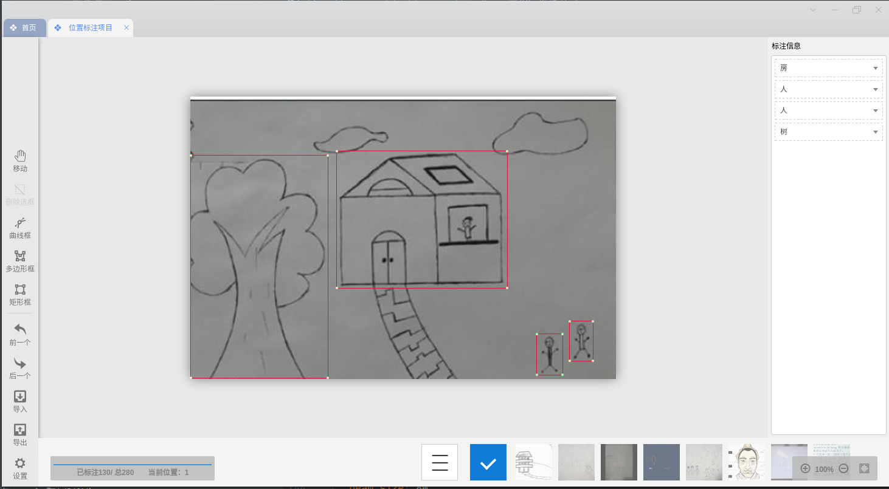
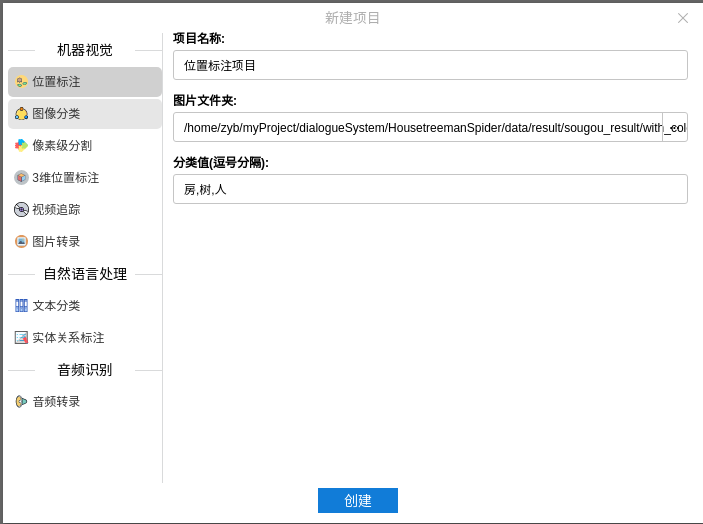
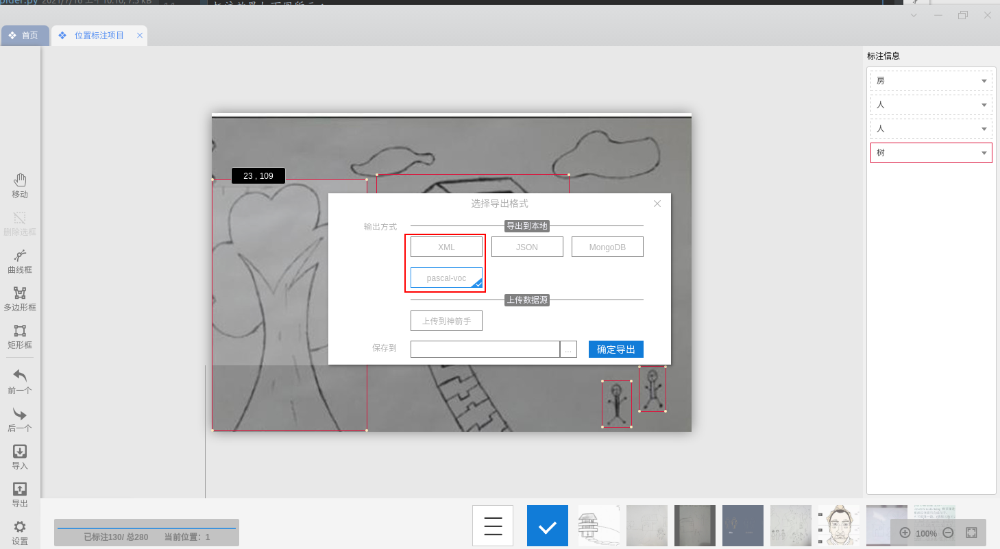
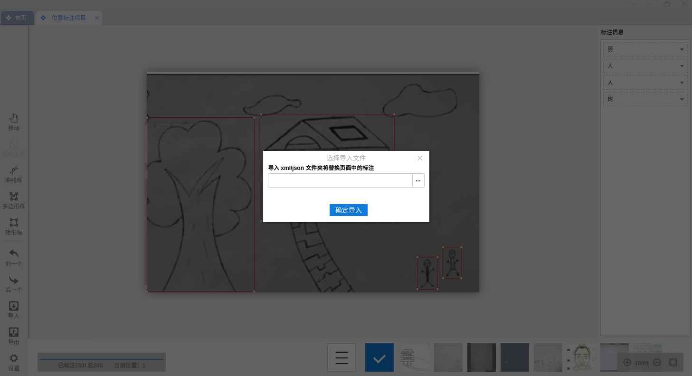

## 百度爬虫
`python baidu_spider.py`
## 谷歌爬虫
注意谷歌爬虫需要翻墙  
`python google_spider.py`
## 搜狗爬虫
`python sougou_spider.py`
## 图片预处理
`python img_process.py`
## 图像标注
这里推荐使用图像标注工具[精灵标注助手](http://www.jinglingbiaozhu.com/)
标注效果如下图所示：  

* 标注步骤：  
    1. 创建工程，如图所示：  
        
    2. 分别进行`房`，`树`，`人`标注
* 工程导出
    1. 点击导出即可，注意必须分别保存成`XML`,`pasca-voc`两种格式，
    其中`XML`格式用于导入使用，`pasca-voc`格式是我们训练模型正式使用的格式，如图所示:
        
* 工程导入
    1. 点击导入即可，导入刚才生成的`XML`格式数据即可，之前没有标注完可以接着标注。如图所示:
        
* 标注结果示例  
参见`data/result/sougou_treeman_result/annotation_with_color_but_grey`
